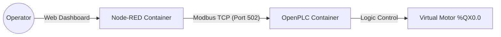

# Hybrid IIoT Closed-Loop Control System with Digital Twin

## Project Overview

This project implements a complete **Industrial IoT (IIoT)** ecosystem utilizing a **SoftPLC (OpenPLC)** and an Edge Gateway (**Node-RED**). It demonstrates a **Closed-Loop Control System** for an industrial fan with a safety-critical Start-Stop latching circuit and a real-time **Digital Twin 3D visualization**.

The system is fully containerized using Docker, simulating a modern Industry 4.0 architecture where IT and OT systems converge.

### Key Engineering Concepts
* **IEC 61131-3 Programming:** Ladder Logic implementation of a latching circuit with Stop-Dominant safety logic.
* **Industrial Communication:** Modbus TCP (Client/Server architecture) handling real-time I/O.
* **Edge Computing:** Node-RED processes raw PLC data and manages the HMI state.
* **Digital Twin:** Real-time 3D animation driven by process variables (CSS3 & JavaScript).
* **Containerization:** Infrastructure as Code using Docker & Docker Compose.

---

## Architecture

The system consists of two isolated containers communicating via an internal Docker network.



### 1. Control Layer: OpenPLC (SoftPLC)

-   **Role:** Industrial Controller.
    
-   **Logic:** Executes the control loop in Structured Text (ST) derived from Ladder Logic.
    
-   **I/O Mapping:**
    
    -   `%QX0.0` (Coil): Motor Output.
        
    -   `%QX0.1` (Coil): Start Command (Virtual Button).
        
    -   `%QX0.2` (Coil): Stop Command (Virtual Button).
        

### 2. SCADA/HMI Layer: Node-RED

-   **Role:** Modbus Master & HMI Server.
    
-   **Logic:**
    
    -   Polls PLC memory map every 1000ms.
        
    -   Sends momentary triggers (250ms) to emulate physical push-buttons.
        
    -   Visualizes machine state using a custom Dashboard 2.0 interface.
        
    -   Renders the 3D Fan Digital Twin based on live boolean data.
        

----------

## Implementation Details

### PLC Logic (IEC 61131-3)

The logic ensures the motor stays running after the Start button is released (Latching) and stops immediately if the Stop button is pressed (Safety).

**Source Code (`Projekt_StartStop.st`):**

Fragment kodu

```
PROGRAM Projekt_StartStop
  VAR
    MY_START AT %QX0.1 : BOOL;
    MY_STOP AT %QX0.2 : BOOL;
    MY_MOTOR AT %QX0.0 : BOOL;
  END_VAR

  (* Latching Logic: (Motor OR Start) AND NOT Stop *)
  MY_MOTOR := NOT(MY_STOP) AND (MY_MOTOR OR MY_START);
END_PROGRAM

```

----------

## How to Run

### Prerequisites

-   Docker & Docker Compose.
    

### Installation

1.  **Clone the repository.**
    
2.  **Start the stack:**
    
    Bash
    
    ```
    docker-compose up -d
    
    ```
    
3.  **Load PLC Logic:**
    
    -   Go to `http://localhost:8080` (OpenPLC).
        
    -   Upload `Projekt_StartStop.st`.
        
    -   Start the PLC.
        
4.  **Load HMI:**
    
    -   Go to `http://localhost:1880` (Node-RED).
        
    -   Import `flows.json`.
        
    -   Deploy.
        
5.  **Control:**
    
    -   Access the Dashboard at `http://localhost:1880/dashboard`.
        

----------

## 📂 Project Structure

-   `docker-compose.yml` - Infrastructure definition.
    
-   `Projekt_StartStop.st` - PLC Source Code.
    
-   `flows.json` - Node-RED Logic & Dashboard definition.
    
-   `/images` - Project screenshots.
